# 基于Springboot的学生评奖评优管理系统

## Springboot-0089


## 技术栈

Springboot mybatisplus vue mysql maven


## 数据库表(14张)


## 功能介绍

```properties
本学生评奖评优管理系统有管理员和教师和学生。

管理员功能有个人中心，学生管理，教师管理，院系信息管理，班级信息管理，学生成绩管理，奖学金申请管理，奖学金获得情况管理，信息异议反馈管理，纪律通报管理，系统管理等。

教师功能有个人中心，学生管理，学生成绩管理，获奖证书管理，好人好事证明管理，纪律通报管理等。

学生功能有个人中心，学生成绩管理，奖学金申请管理，奖学金获得情况管理，获奖证书管理，好人好事证明管理，信息异议反馈管理，纪律通报管理等。
```


## 图片

### 前台


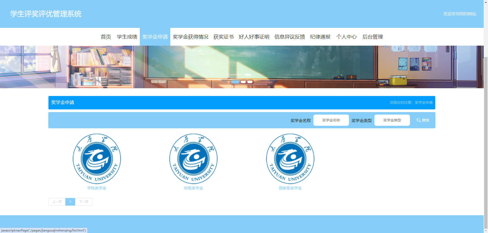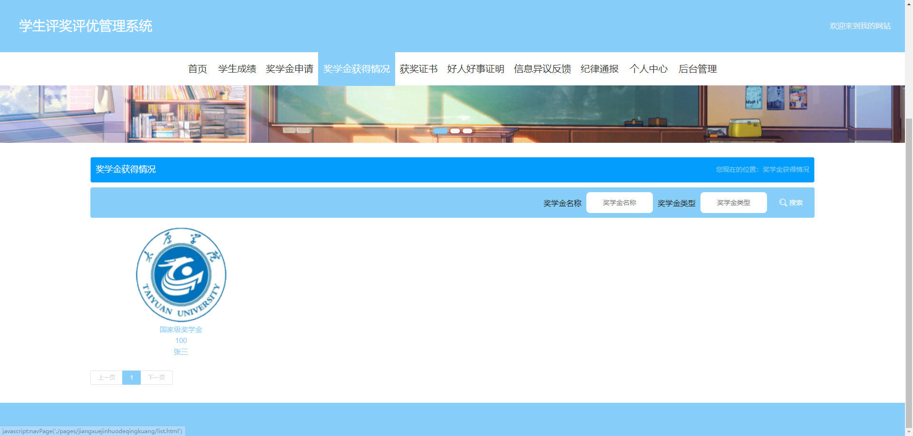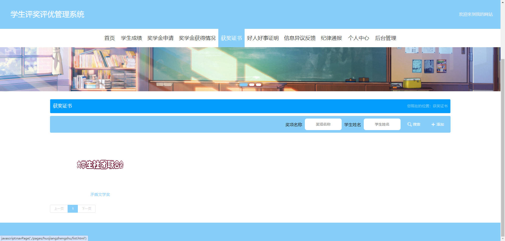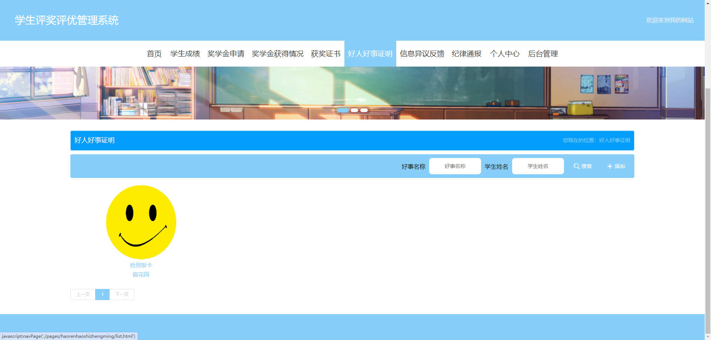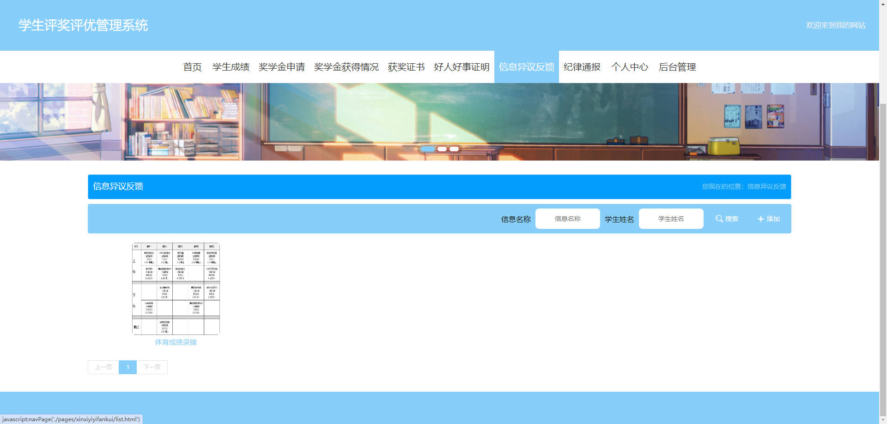

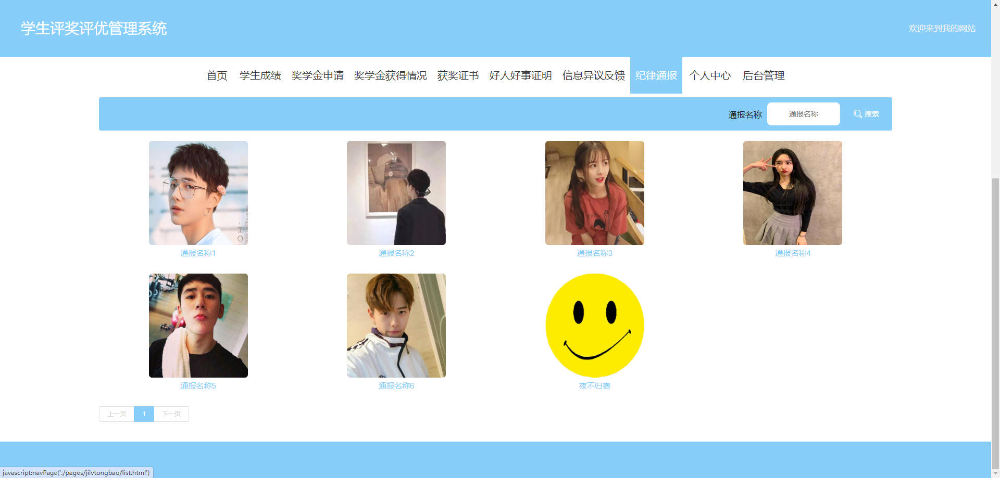

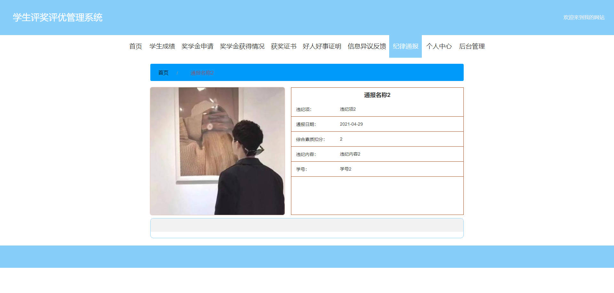


### 后台

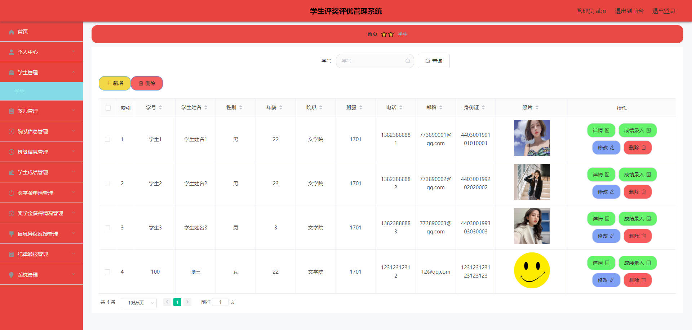

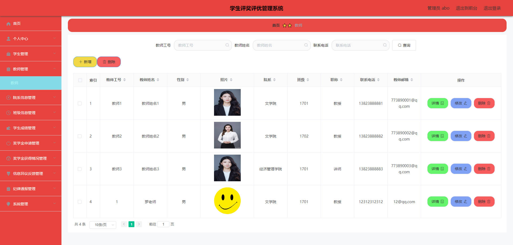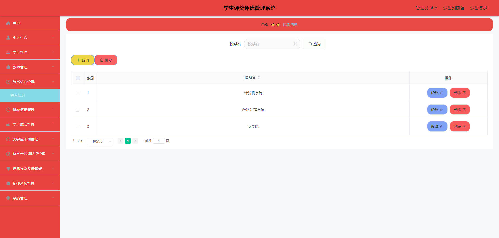

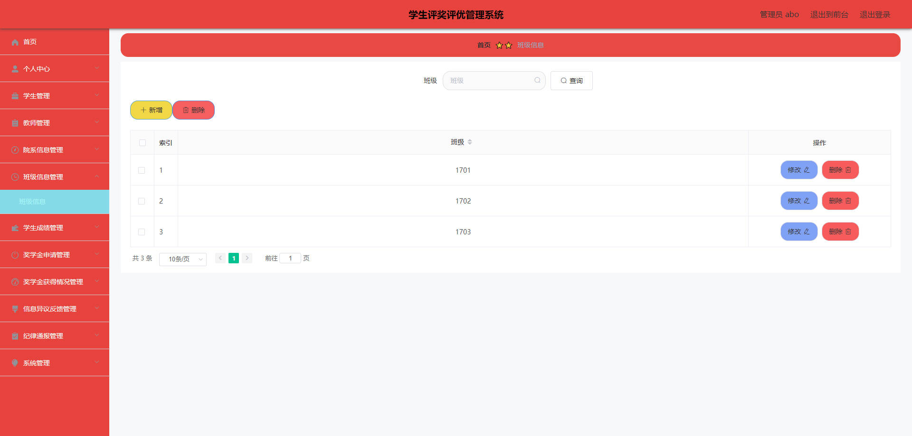

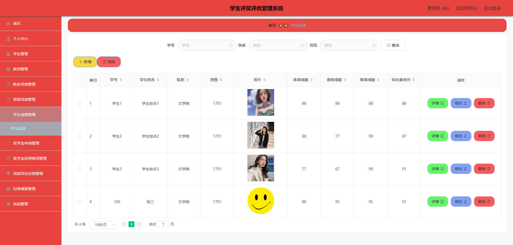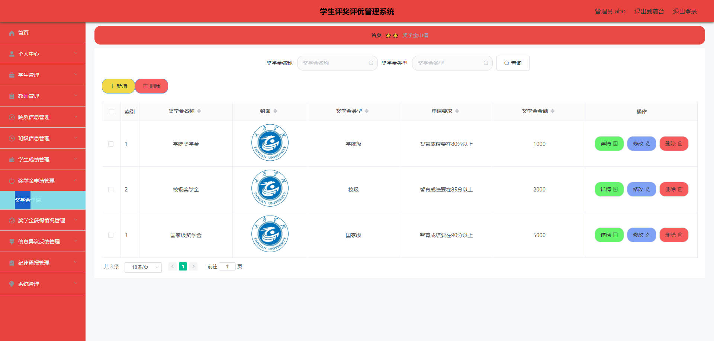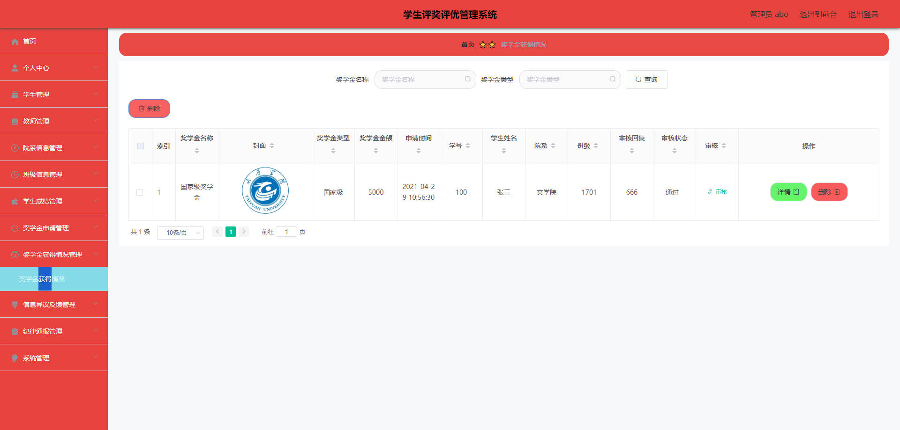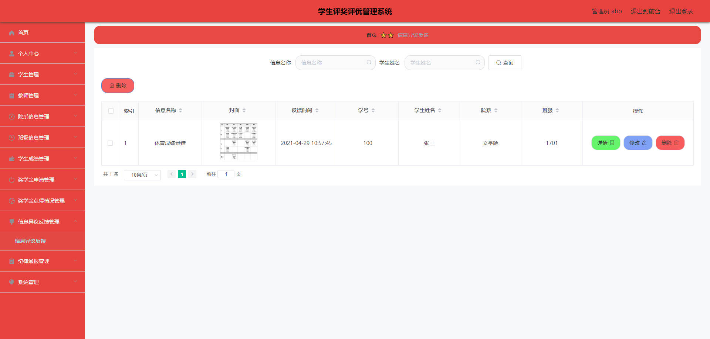

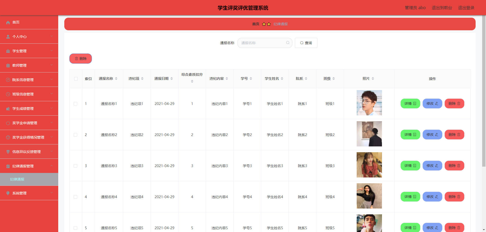


## 访问路径

### 前台

```properties
http://localhost:8080/springbootx877q/front/pages/login/login.html

账号 100
密码 123456
```

### 后台

```properties
http://localhost:8080/springbootx877q/admin/dist/index.html#/login

账号 abo
密码 abo
```


## 功能图

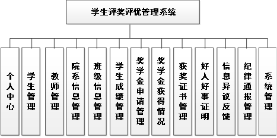


## 文档目录

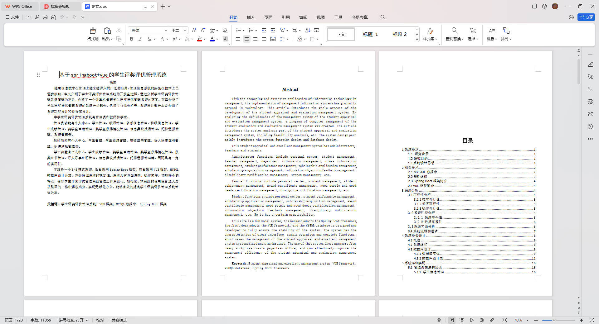


## 打赏或交流


